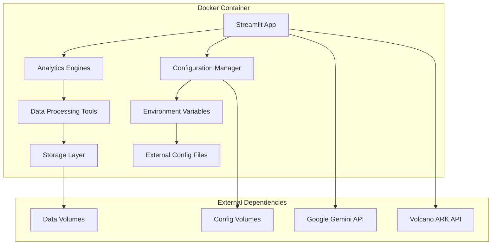

# Design Document

## Overview

This design outlines the containerization strategy for the User Behavior Analytics Platform using Docker. The solution will provide both development and production-ready containers with proper configuration management, security, and deployment flexibility.

## Architecture

### Container Architecture



### Multi-Stage Build Strategy

The Docker image will use a multi-stage build approach:

1. **Base Stage**: Python runtime with system dependencies
2. **Dependencies Stage**: Install Python packages and dependencies
3. **Application Stage**: Copy application code and configure runtime
4. **Production Stage**: Minimal runtime with security optimizations

## Components and Interfaces

### 1. Dockerfile Structure

**Base Configuration:**
- Python 3.11 slim base image for optimal size/performance balance
- Non-root user creation for security
- System dependencies installation (build tools, system libraries)

**Dependencies Management:**
- Requirements.txt installation with pip caching
- Virtual environment setup for isolation
- Cleanup of build dependencies in production stage

**Application Setup:**
- Application code copying with proper ownership
- Configuration directory structure creation
- Entry point script configuration

### 2. Docker Compose Configuration

**Development Environment:**
```yaml
services:
  analytics-platform:
    build: .
    ports:
      - "8501:8501"
    volumes:
      - ./data:/app/data
      - ./config:/app/config
      - ./.env:/app/.env
    environment:
      - STREAMLIT_SERVER_HEADLESS=true
      - STREAMLIT_SERVER_PORT=8501
```

**Production Environment:**
```yaml
services:
  analytics-platform:
    image: analytics-platform:latest
    ports:
      - "8501:8501"
    volumes:
      - analytics-data:/app/data
      - analytics-config:/app/config
    environment:
      - STREAMLIT_SERVER_HEADLESS=true
      - STREAMLIT_SERVER_PORT=8501
    healthcheck:
      test: ["CMD", "curl", "-f", "http://localhost:8501/_stcore/health"]
      interval: 30s
      timeout: 10s
      retries: 3
```

### 3. Configuration Management

**Environment Variable Mapping:**
- All configuration parameters from `.env` file mapped to container environment
- Sensitive variables (API keys) handled through Docker secrets or external secret management
- Configuration validation on container startup

**Volume Mounts:**
- `/app/data` - Persistent data storage for uploaded files and processed data
- `/app/config` - External configuration files
- `/app/logs` - Application logs (optional, can use container logging)
- `/app/reports` - Generated reports output

### 4. Entry Point Script

**Startup Sequence:**
1. Environment validation and configuration loading
2. Directory structure verification and creation
3. Health check endpoint setup
4. Streamlit application launch with proper configuration

**Script Features:**
- Graceful shutdown handling
- Configuration validation with clear error messages
- Automatic directory creation for required paths
- Support for both development and production modes

## Data Models

### Container Configuration Model

```python
@dataclass
class ContainerConfig:
    port: int = 8501
    host: str = "0.0.0.0"
    data_dir: str = "/app/data"
    config_dir: str = "/app/config"
    logs_dir: str = "/app/logs"
    reports_dir: str = "/app/reports"
    max_upload_size: str = "100MB"
    workers: int = 1
    timeout: int = 300
```

### Environment Configuration Model

```python
@dataclass
class EnvironmentConfig:
    # API Configuration
    google_api_key: Optional[str] = None
    ark_api_key: Optional[str] = None
    ark_base_url: str = "https://ark.cn-beijing.volces.com/api/v3"
    
    # Application Configuration
    app_title: str = "用户行为分析智能体平台"
    log_level: str = "INFO"
    debug_mode: bool = False
    
    # Streamlit Configuration
    streamlit_headless: bool = True
    streamlit_port: int = 8501
    streamlit_max_upload_size: int = 100
```

## Error Handling

### Container Startup Errors

**Configuration Validation:**
- Missing required environment variables
- Invalid API key format or accessibility
- Insufficient permissions for data directories
- Port binding conflicts

**Error Response Strategy:**
- Clear error messages with resolution guidance
- Graceful degradation for non-critical configuration issues
- Health check failures with detailed status information
- Automatic retry mechanisms for transient failures

### Runtime Error Handling

**Application Errors:**
- Streamlit application crashes with automatic restart
- Memory limit exceeded with graceful shutdown
- Disk space issues with cleanup procedures
- Network connectivity problems with fallback mechanisms

**Monitoring Integration:**
- Container health checks for orchestration platforms
- Log aggregation compatibility (JSON structured logging)
- Metrics exposure for monitoring systems
- Alert integration for critical failures

## Testing Strategy

### Container Testing Approach

**Build Testing:**
1. **Multi-stage Build Validation**: Verify each build stage completes successfully
2. **Image Size Optimization**: Ensure production image meets size requirements (<2GB)
3. **Security Scanning**: Automated vulnerability scanning of final image
4. **Dependency Verification**: Confirm all required packages are installed correctly

**Runtime Testing:**
1. **Startup Testing**: Verify container starts successfully with various configurations
2. **Health Check Testing**: Validate health check endpoints respond correctly
3. **Volume Mount Testing**: Confirm data persistence and configuration loading
4. **Environment Variable Testing**: Test all configuration scenarios

**Integration Testing:**
1. **API Connectivity**: Test connections to Google Gemini and Volcano ARK APIs
2. **Data Processing**: Verify GA4 data processing works in containerized environment
3. **Report Generation**: Confirm report generation and export functionality
4. **Multi-container Testing**: Test Docker Compose configurations

### Test Data and Scenarios

**Configuration Test Cases:**
- Minimal configuration (required variables only)
- Full configuration (all optional variables set)
- Invalid configuration (missing required variables)
- Mixed provider configuration (Google only, Volcano only, both)

**Data Processing Test Cases:**
- Small dataset processing (< 1MB)
- Large dataset processing (> 50MB)
- Multiple concurrent uploads
- Data persistence across container restarts

**Performance Test Cases:**
- Memory usage under load
- CPU utilization during analysis
- Startup time optimization
- Response time for web interface

## Security Considerations

### Container Security

**Base Image Security:**
- Use official Python slim images with latest security patches
- Regular base image updates through automated builds
- Minimal attack surface with only required packages

**Runtime Security:**
- Non-root user execution (analytics user with UID 1000)
- Read-only root filesystem where possible
- Capability dropping for unnecessary privileges
- Resource limits (memory, CPU) to prevent resource exhaustion

### Configuration Security

**Secrets Management:**
- Environment variables for non-sensitive configuration
- Docker secrets or external secret management for API keys
- No hardcoded credentials in image layers
- Secure defaults for all configuration options

**Network Security:**
- Minimal exposed ports (only Streamlit port 8501)
- Internal network communication for multi-container setups
- HTTPS support through reverse proxy configuration
- API rate limiting and timeout configurations

## Deployment Scenarios

### Development Deployment

**Docker Compose Development:**
```bash
# Quick start for development
docker-compose -f docker-compose.dev.yml up --build

# With specific environment file
docker-compose --env-file .env.dev up
```

**Features:**
- Hot reload for code changes
- Local volume mounts for development
- Debug mode enabled
- Exposed ports for direct access

### Production Deployment

**Standalone Container:**
```bash
# Build production image
docker build -t analytics-platform:latest .

# Run with production configuration
docker run -d \
  --name analytics-platform \
  -p 8501:8501 \
  -v analytics-data:/app/data \
  -v analytics-config:/app/config \
  --env-file .env.prod \
  analytics-platform:latest
```

**Container Orchestration (Kubernetes):**
- Deployment manifests for Kubernetes
- ConfigMap and Secret management
- Persistent Volume Claims for data storage
- Service and Ingress configuration
- Horizontal Pod Autoscaling support

### Cloud Deployment

**Docker Hub/Registry:**
- Automated builds on code changes
- Multi-architecture support (amd64, arm64)
- Semantic versioning for releases
- Security scanning integration

**Cloud Platform Integration:**
- AWS ECS/Fargate deployment guides
- Google Cloud Run configuration
- Azure Container Instances setup
- Platform-specific optimization recommendations

## Performance Optimization

### Image Optimization

**Size Reduction:**
- Multi-stage builds to exclude build dependencies
- .dockerignore file to exclude unnecessary files
- Layer caching optimization for faster builds
- Minimal base image selection

**Runtime Optimization:**
- Python bytecode compilation
- Streamlit configuration tuning
- Memory allocation optimization
- CPU affinity configuration for multi-core systems

### Resource Management

**Memory Management:**
- Configurable memory limits for different deployment sizes
- Garbage collection tuning for large datasets
- Streaming data processing for memory efficiency
- Cache management for frequently accessed data

**Storage Optimization:**
- Efficient data serialization formats
- Temporary file cleanup procedures
- Log rotation and archival
- Report cleanup policies

## Monitoring and Observability

### Health Checks

**Application Health:**
- Streamlit application responsiveness
- API connectivity verification
- Database/storage accessibility
- Memory and disk usage monitoring

**Custom Health Endpoints:**
- `/health` - Basic application status
- `/health/detailed` - Comprehensive system status
- `/metrics` - Prometheus-compatible metrics
- `/version` - Application version information

### Logging Strategy

**Structured Logging:**
- JSON format for log aggregation
- Correlation IDs for request tracing
- Log level configuration through environment variables
- Sensitive data redaction in logs

**Log Aggregation:**
- Container stdout/stderr for orchestration platforms
- Optional file-based logging for persistent storage
- Integration with ELK stack, Fluentd, or similar
- Log retention and rotation policies