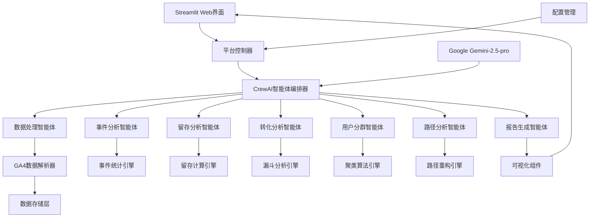
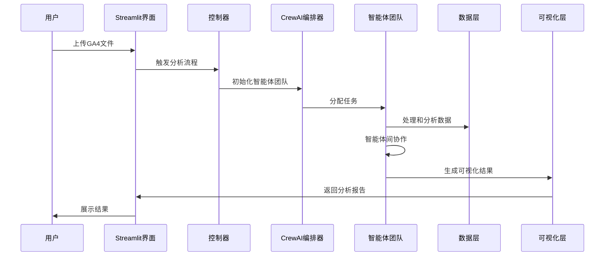

# 设计文档

## 概述

用户行为分析智能体平台是一个基于CrewAI多智能体框架的自动化数据分析系统。该平台通过协调多个专业化AI智能体，对GA4事件数据进行深度分析，生成用户行为洞察和业务建议。系统采用模块化设计，支持插件式扩展，并通过Streamlit提供直观的Web界面。

## 架构

### 整体架构



### 数据流架构



## 组件和接口

### 1. 智能体系统

#### 数据处理智能体 (Data Processing Agent)
- **角色**: 数据工程师
- **目标**: 解析和预处理GA4事件数据
- **工具**: 
  - GA4DataParser: 解析NDJSON格式数据
  - DataValidator: 验证数据完整性
  - DataCleaner: 清洗和标准化数据
- **输出**: 结构化的用户事件数据集

#### 事件分析智能体 (Event Analysis Agent)
- **角色**: 事件分析专家
- **目标**: 分析用户事件模式和趋势
- **工具**:
  - EventCounter: 统计事件频次
  - TrendAnalyzer: 分析事件趋势
  - EventCorrelator: 分析事件关联性
- **输出**: 事件分析报告和可视化图表

#### 留存分析智能体 (Retention Analysis Agent)
- **角色**: 留存分析专家
- **目标**: 计算和分析用户留存率
- **工具**:
  - CohortBuilder: 构建用户队列
  - RetentionCalculator: 计算留存率
  - ChurnPredictor: 预测用户流失
- **输出**: 留存分析报告和留存曲线

#### 转化分析智能体 (Conversion Analysis Agent)
- **角色**: 转化优化专家
- **目标**: 分析用户转化漏斗
- **工具**:
  - FunnelBuilder: 构建转化漏斗
  - ConversionCalculator: 计算转化率
  - BottleneckIdentifier: 识别转化瓶颈
- **输出**: 转化漏斗分析和优化建议

#### 用户分群智能体 (User Segmentation Agent)
- **角色**: 用户研究专家
- **目标**: 基于行为特征进行用户分群
- **工具**:
  - FeatureExtractor: 提取用户特征
  - ClusteringEngine: 执行聚类算法
  - SegmentProfiler: 生成群体画像
- **输出**: 用户分群结果和群体特征描述

#### 路径分析智能体 (Path Analysis Agent)
- **角色**: 用户体验分析师
- **目标**: 分析用户行为路径和导航模式
- **工具**:
  - SessionReconstructor: 重构用户会话
  - PathMiner: 挖掘常见路径
  - FlowVisualizer: 生成行为流程图
- **输出**: 用户路径分析和流程优化建议

#### 报告生成智能体 (Report Generation Agent)
- **角色**: 业务分析师
- **目标**: 汇总分析结果并生成综合报告
- **工具**:
  - ReportCompiler: 编译分析结果
  - InsightGenerator: 生成业务洞察
  - RecommendationEngine: 提供行动建议
- **输出**: 综合分析报告和业务建议

### 2. 数据处理层

#### GA4数据解析器
```python
class GA4DataParser:
    def parse_ndjson(self, file_path: str) -> pd.DataFrame
    def extract_events(self, data: pd.DataFrame) -> Dict[str, pd.DataFrame]
    def extract_user_properties(self, data: pd.DataFrame) -> pd.DataFrame
    def extract_sessions(self, data: pd.DataFrame) -> pd.DataFrame
```

#### 数据存储管理器
```python
class DataStorageManager:
    def store_events(self, events: pd.DataFrame) -> None
    def store_users(self, users: pd.DataFrame) -> None
    def store_sessions(self, sessions: pd.DataFrame) -> None
    def get_data(self, data_type: str, filters: Dict) -> pd.DataFrame
```

### 3. 分析引擎

#### 事件分析引擎
```python
class EventAnalysisEngine:
    def calculate_event_frequency(self, events: pd.DataFrame) -> Dict
    def analyze_event_trends(self, events: pd.DataFrame) -> Dict
    def identify_key_events(self, events: pd.DataFrame) -> List[str]
```

#### 留存分析引擎
```python
class RetentionAnalysisEngine:
    def build_cohorts(self, users: pd.DataFrame) -> pd.DataFrame
    def calculate_retention_rates(self, cohorts: pd.DataFrame) -> pd.DataFrame
    def generate_retention_heatmap(self, retention_data: pd.DataFrame) -> Dict
```

#### 转化分析引擎
```python
class ConversionAnalysisEngine:
    def build_funnel(self, events: pd.DataFrame, steps: List[str]) -> pd.DataFrame
    def calculate_conversion_rates(self, funnel: pd.DataFrame) -> Dict
    def identify_drop_off_points(self, funnel: pd.DataFrame) -> List[Dict]
```

### 4. 可视化组件

#### 图表生成器
```python
class ChartGenerator:
    def create_event_timeline(self, data: pd.DataFrame) -> plotly.graph_objects.Figure
    def create_retention_heatmap(self, data: pd.DataFrame) -> plotly.graph_objects.Figure
    def create_funnel_chart(self, data: pd.DataFrame) -> plotly.graph_objects.Figure
    def create_user_flow_diagram(self, data: pd.DataFrame) -> plotly.graph_objects.Figure
```

## 数据模型

### 事件数据模型
```python
@dataclass
class EventData:
    event_date: str
    event_timestamp: int
    event_name: str
    user_pseudo_id: str
    user_id: str
    platform: str
    device: Dict
    geo: Dict
    traffic_source: Dict
    event_params: List[Dict]
    user_properties: List[Dict]
    items: Optional[List[Dict]]
```

### 用户会话模型
```python
@dataclass
class UserSession:
    session_id: str
    user_id: str
    start_time: datetime
    end_time: datetime
    events: List[EventData]
    duration: int
    page_views: int
    conversions: int
```

### 分析结果模型
```python
@dataclass
class AnalysisResult:
    analysis_type: str
    timestamp: datetime
    data: Dict
    insights: List[str]
    recommendations: List[str]
    visualizations: Dict
```

## 错误处理

### 错误类型定义
```python
class DataProcessingError(Exception):
    """数据处理相关错误"""
    pass

class AnalysisError(Exception):
    """分析计算相关错误"""
    pass

class VisualizationError(Exception):
    """可视化生成相关错误"""
    pass
```

### 错误处理策略
1. **数据验证错误**: 提供详细的错误信息和数据修复建议
2. **分析计算错误**: 记录错误日志，提供降级分析方案
3. **智能体通信错误**: 实现重试机制和故障转移
4. **可视化错误**: 提供备用图表类型和错误提示

## 测试策略

### 单元测试
- 数据解析器测试
- 分析引擎功能测试
- 智能体工具测试
- 可视化组件测试

### 集成测试
- 智能体协作流程测试
- 端到端数据处理测试
- Streamlit界面集成测试

### 性能测试
- 大数据集处理性能测试
- 并发用户访问测试
- 内存使用优化测试

### 数据质量测试
- GA4数据格式验证
- 分析结果准确性验证
- 可视化数据一致性测试