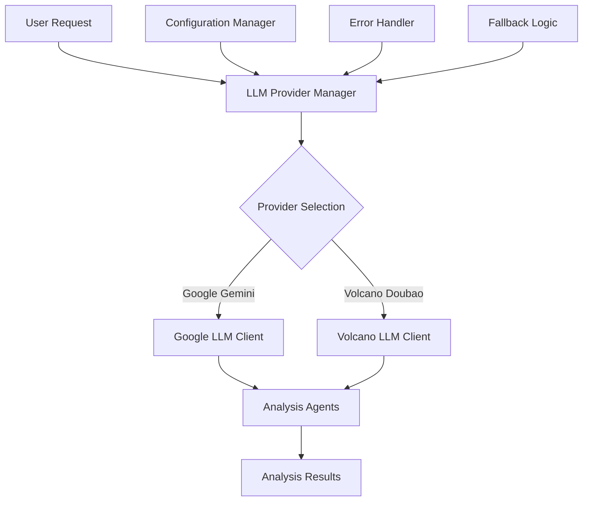
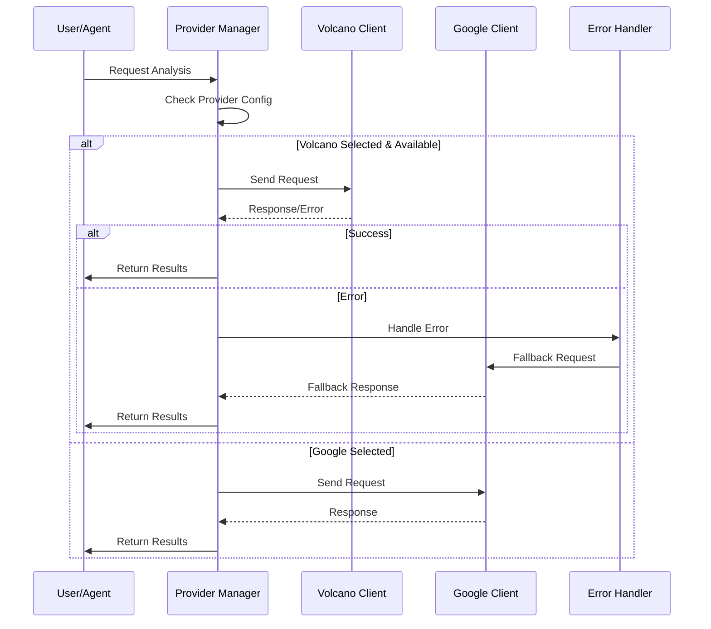

# Design Document

## Overview

The Volcano API integration adds support for ByteDance's Doubao (豆包) LLM as an alternative provider to Google Gemini in the user behavior analytics platform. The design follows the existing LLM provider pattern while extending it to support multi-modal capabilities and provider selection. The integration uses OpenAI-compatible API calls through the Volcano ARK platform, ensuring seamless compatibility with existing agent workflows.

## Architecture

### High-Level Architecture



### Provider Selection Flow



## Components and Interfaces

### 1. LLM Provider Manager

**Purpose**: Central management of multiple LLM providers with automatic fallback capabilities.

**Key Responsibilities**:
- Provider selection based on configuration
- Request routing to appropriate provider
- Error handling and fallback logic
- Response format standardization

**Interface**:
```python
class LLMProviderManager:
    def get_llm(self, provider: str = None, **kwargs) -> BaseLLM
    def get_available_providers(self) -> List[str]
    def set_default_provider(self, provider: str) -> None
    def health_check(self, provider: str) -> bool
```

### 2. Volcano LLM Client

**Purpose**: OpenAI-compatible client for Volcano Doubao API integration.

**Key Responsibilities**:
- API authentication and connection management
- Request/response handling with proper error handling
- Multi-modal content support (text + images)
- Rate limiting and retry logic

**Interface**:
```python
class VolcanoLLMClient(BaseLLM):
    def __init__(self, api_key: str, base_url: str, model: str)
    def _call(self, prompt: str, **kwargs) -> str
    def _generate(self, messages: List[BaseMessage], **kwargs) -> LLMResult
    def _agenerate(self, messages: List[BaseMessage], **kwargs) -> LLMResult
    def supports_multimodal(self) -> bool
```

### 3. Enhanced Settings Configuration

**Purpose**: Extended configuration management for multiple LLM providers.

**Key Additions**:
- Volcano API configuration
- Provider selection settings
- Fallback configuration
- Multi-modal settings

**Configuration Schema**:
```python
class LLMProviderConfig(BaseModel):
    name: str
    enabled: bool
    api_key: Optional[str]
    base_url: Optional[str]
    model: str
    temperature: float
    max_tokens: int
    supports_multimodal: bool
    priority: int  # For fallback ordering
```

### 4. Multi-Modal Content Handler

**Purpose**: Handle mixed text and image content for analysis requests.

**Key Responsibilities**:
- Content type detection and validation
- Image URL processing and validation
- Content formatting for different providers
- Error handling for unsupported content types

**Interface**:
```python
class MultiModalContentHandler:
    def prepare_content(self, content: Union[str, List[Dict]]) -> List[Dict]
    def validate_image_url(self, url: str) -> bool
    def format_for_provider(self, content: List[Dict], provider: str) -> Any
```

## Data Models

### LLM Provider Configuration

```python
class LLMProviderSettings(BaseSettings):
    # Existing Google configuration
    google_api_key: Optional[str] = Field(env="GOOGLE_API_KEY")
    
    # New Volcano configuration
    ark_api_key: Optional[str] = Field(env="ARK_API_KEY")
    ark_base_url: str = Field(default="https://ark.cn-beijing.volces.com/api/v3")
    ark_model: str = Field(default="doubao-seed-1-6-250615")
    
    # Provider selection
    default_llm_provider: str = Field(default="google")
    enabled_providers: List[str] = Field(default=["google", "volcano"])
    
    # Fallback configuration
    enable_fallback: bool = Field(default=True)
    fallback_order: List[str] = Field(default=["google", "volcano"])
    
    # Multi-modal settings
    enable_multimodal: bool = Field(default=True)
    max_image_size_mb: int = Field(default=10)
```

### Multi-Modal Request Model

```python
class MultiModalRequest(BaseModel):
    content: List[Union[TextContent, ImageContent]]
    provider: Optional[str] = None
    analysis_type: str
    parameters: Dict[str, Any] = {}

class TextContent(BaseModel):
    type: Literal["text"]
    text: str

class ImageContent(BaseModel):
    type: Literal["image_url"]
    image_url: ImageUrl

class ImageUrl(BaseModel):
    url: str
    detail: Optional[str] = "auto"
```

### Provider Response Model

```python
class LLMResponse(BaseModel):
    content: str
    provider_used: str
    model_used: str
    tokens_used: Optional[int] = None
    response_time: float
    fallback_used: bool = False
    error: Optional[str] = None
```

## Error Handling

### Error Categories and Responses

1. **Authentication Errors**
   - Invalid API keys
   - Expired tokens
   - Response: Log error, attempt fallback provider

2. **Rate Limiting Errors**
   - API quota exceeded
   - Request rate too high
   - Response: Implement exponential backoff, switch to fallback

3. **Network Errors**
   - Connection timeouts
   - DNS resolution failures
   - Response: Retry with backoff, fallback to alternative provider

4. **Content Errors**
   - Unsupported image formats
   - Content too large
   - Response: Validate content before sending, provide user feedback

5. **Model Errors**
   - Model unavailable
   - Invalid parameters
   - Response: Log error details, use fallback provider

### Error Handling Strategy

```python
class LLMErrorHandler:
    def handle_error(self, error: Exception, provider: str, request_data: Dict) -> LLMResponse:
        if isinstance(error, AuthenticationError):
            return self._handle_auth_error(error, provider)
        elif isinstance(error, RateLimitError):
            return self._handle_rate_limit_error(error, provider, request_data)
        elif isinstance(error, NetworkError):
            return self._handle_network_error(error, provider, request_data)
        else:
            return self._handle_generic_error(error, provider)
    
    def _attempt_fallback(self, original_provider: str, request_data: Dict) -> LLMResponse:
        # Implement fallback logic
        pass
```

## Testing Strategy

### Unit Tests

1. **Provider Manager Tests**
   - Provider selection logic
   - Configuration validation
   - Error handling scenarios
   - Fallback mechanism

2. **Volcano Client Tests**
   - API authentication
   - Request/response handling
   - Multi-modal content processing
   - Error scenarios

3. **Configuration Tests**
   - Settings validation
   - Environment variable loading
   - Provider availability checks

### Integration Tests

1. **End-to-End Provider Tests**
   - Complete analysis workflow with Volcano provider
   - Multi-modal analysis scenarios
   - Provider switching during analysis

2. **Fallback Tests**
   - Automatic fallback when primary provider fails
   - Graceful degradation scenarios
   - Performance impact of fallbacks

3. **Agent Integration Tests**
   - All existing agents work with new provider
   - Consistent output format across providers
   - Performance comparison between providers

### Performance Tests

1. **Response Time Comparison**
   - Benchmark Google vs Volcano response times
   - Multi-modal vs text-only performance
   - Fallback overhead measurement

2. **Load Testing**
   - Concurrent requests handling
   - Rate limiting behavior
   - Resource usage monitoring

### Test Data Requirements

1. **Sample Multi-Modal Content**
   - Various image formats and sizes
   - Text + image combinations
   - Edge cases (large images, invalid URLs)

2. **Mock API Responses**
   - Successful responses from both providers
   - Various error scenarios
   - Rate limiting responses

3. **Configuration Test Cases**
   - Valid and invalid API keys
   - Different provider combinations
   - Fallback scenarios