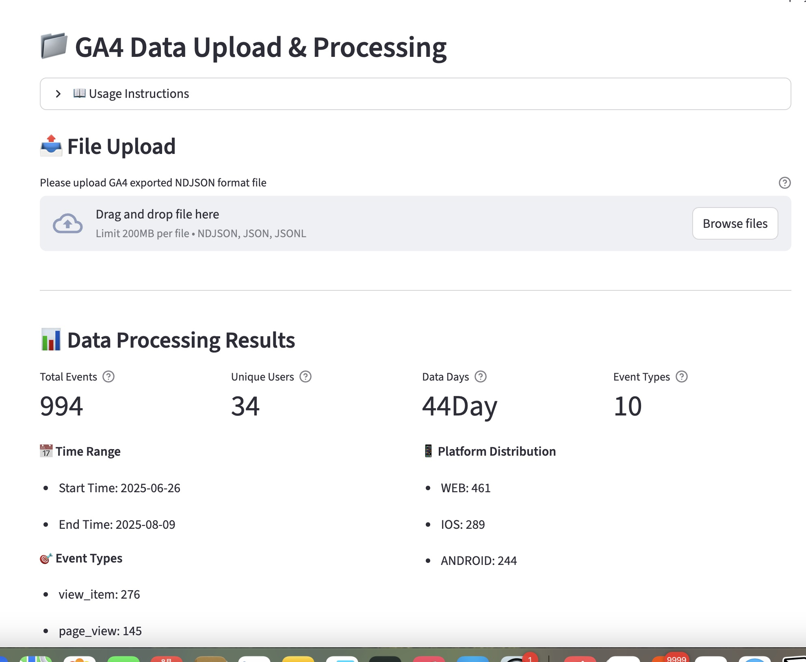
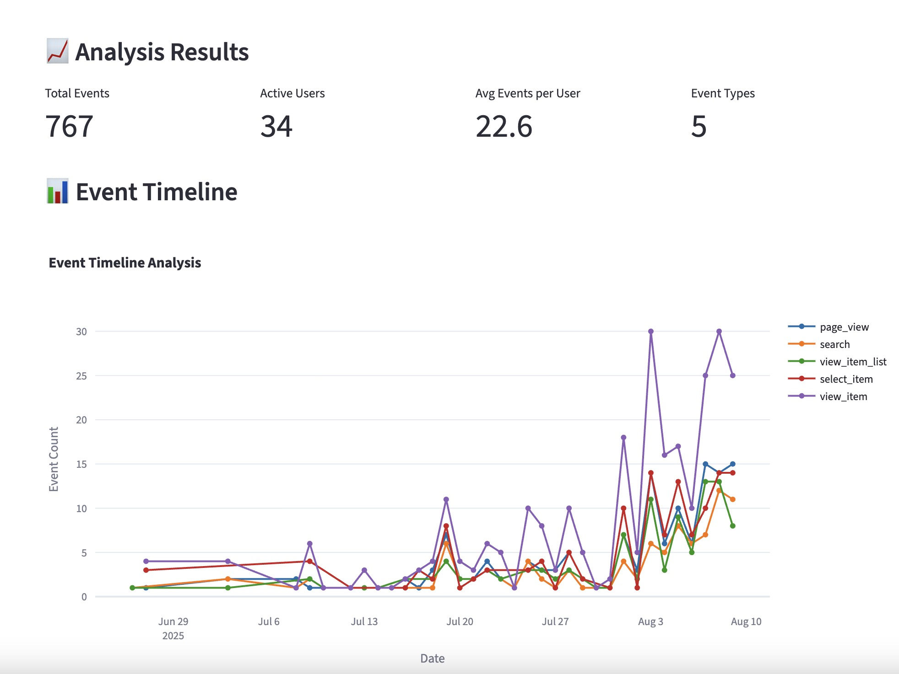
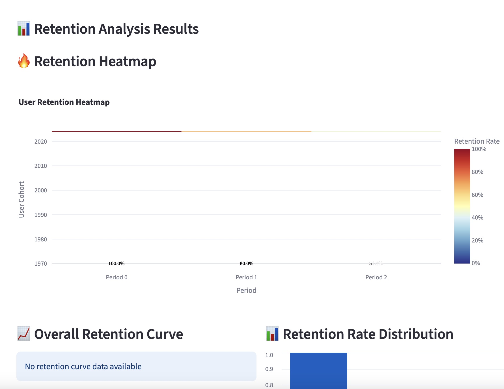
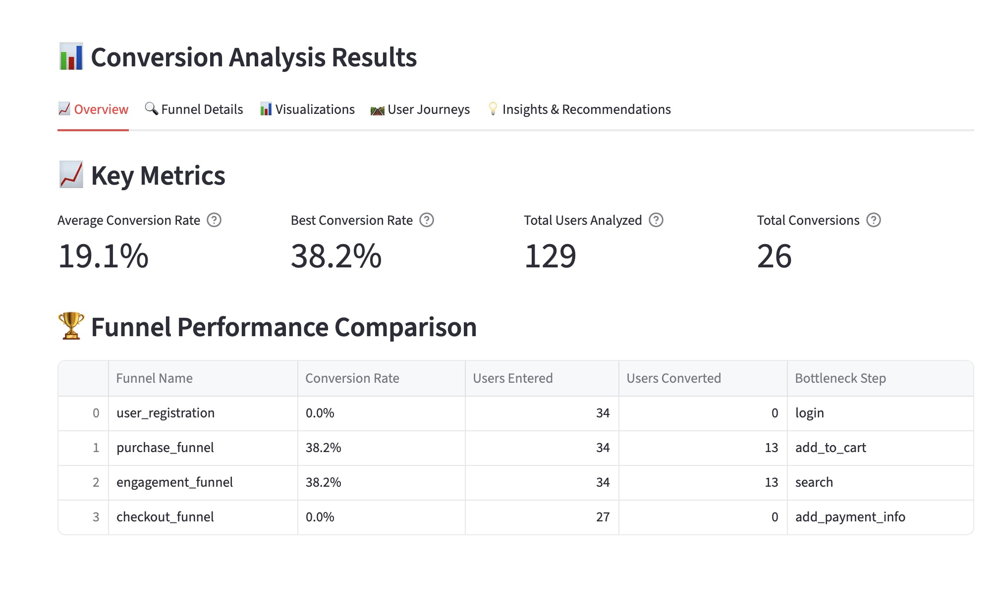
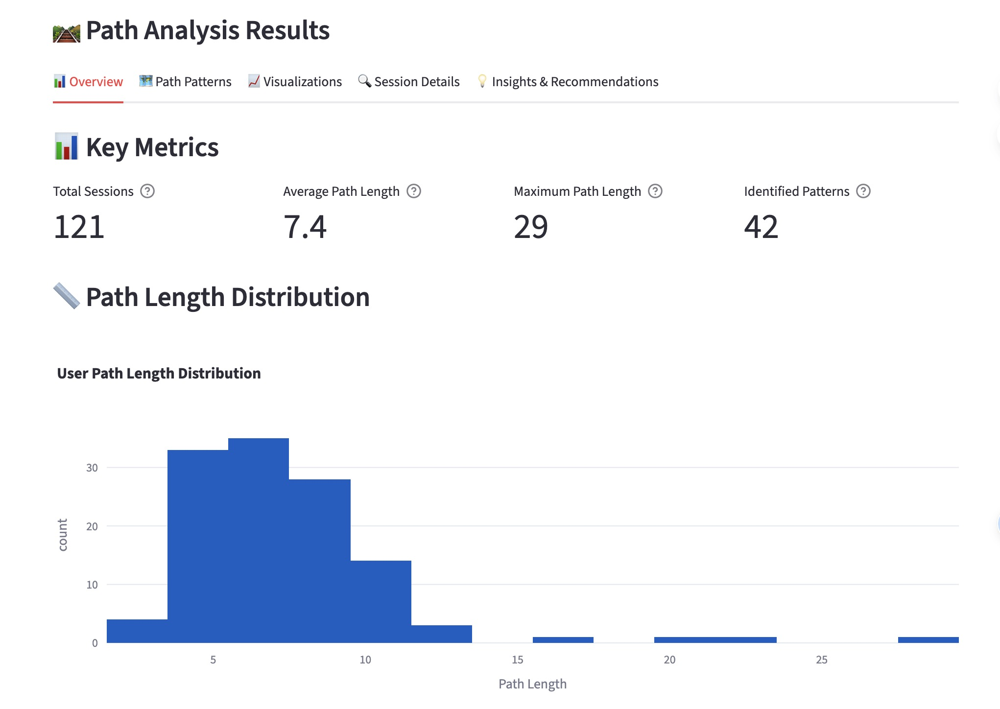

# ZenGrowth - User Behavior Analytics AI Platform

[](https://opensource.org/licenses/MIT)
[](https://www.python.org/downloads/)
[](https://www.docker.com/)
[](https://streamlit.io/)

English Documentation | [中文文档](README_ZH.md)

An automated user behavior analytics system powered by CrewAI multi-agent framework, integrated with Google Gemini and Volcano ARK APIs, providing intelligent GA4 data analysis and business insights.

## 🎥 Demo Video

[](https://www.youtube.com/watch?v=yXLHEkLss9Q)

Watch the complete product demonstration to learn how to use ZenGrowth for intelligent user behavior analytics.

## 🌟 Core Features

### 🤖 Multi-Agent Collaboration System
- **7 Specialized AI Agents**: Data processing, event analysis, retention analysis, conversion analysis, user segmentation, path analysis, and report generation
- **CrewAI Framework**: Agent collaboration and task orchestration
- **Fault Recovery**: Automatic fallback to simplified engines when agents are unavailable

### 🧠 Dual LLM Provider Support
- **Google Gemini-2.5-pro**: Primary AI analysis engine
- **Volcano ARK API**: Backup provider with Chinese optimization
- **Intelligent Failover**: Automatic provider switching and load balancing
- **Multimodal Support**: Comprehensive image and text analysis

### 📊 Comprehensive Data Analysis
- **Event Analysis**: User behavior event pattern recognition and trend analysis
- **Retention Analysis**: User retention calculation and churn prediction
- **Conversion Analysis**: Conversion funnel construction and bottleneck identification
- **User Segmentation**: Intelligent user segmentation based on behavioral characteristics
- **Path Analysis**: User behavior path mining and navigation optimization

### 🎨 Interactive Visualization
- **Streamlit Interface**: Modern web application experience
- **Plotly Charts**: Interactive data visualization
- **Multi-language Support**: Chinese/English interface switching
- **Responsive Design**: Support for multiple devices and screens

### 🔧 Enterprise-Grade Features
- **Docker Containerization**: Production environment deployment optimization
- **Configuration Management**: Flexible environment configuration and parameter tuning
- **Health Monitoring**: Real-time system status and performance monitoring
- **Security**: API key management and access control

## 🏗️ Technical Architecture

```
┌─────────────────────────────────────────────────────────────────┐
│                    UI Layer (Streamlit)                         │
├─────────────────────────────────────────────────────────────────┤
│              Agent Orchestration (CrewAI + Fault Recovery)       │
├─────────────────┬─────────────────┬─────────────────┬─────────────┤
│  Event Analysis │ Retention       │ Conversion      │ Path        │
│     Agent       │  Analysis Agent │ Analysis Agent  │ Analysis    │
├─────────────────┼─────────────────┼─────────────────┼─────────────┤
│  User Segment   │ Data Processing │ Report          │ Visualization│
│     Agent       │     Agent       │ Generation Agent│   Engine     │
├─────────────────────────────────────────────────────────────────┤
│                LLM Provider Layer (Google + Volcano)            │
├─────────────────────────────────────────────────────────────────┤
│                 Data Processing Layer (GA4 + File Storage)      │
└─────────────────────────────────────────────────────────────────┘
```

## 📋 System Requirements

### 🖥️ Local Development
- **Python**: 3.8+ (Recommended 3.9+)
- **Memory**: 8GB+ RAM (Recommended 16GB)
- **Storage**: 2GB+ available disk space
- **API Keys**: Google Gemini API or Volcano ARK API

### 🐳 Docker Deployment (Recommended)
- **Docker Engine**: 20.10+
- **Docker Compose**: 2.0+
- **Memory**: 4GB+ available RAM
- **Storage**: 10GB+ available disk space

## 🚀 Quick Start

### Option 1: Docker Deployment (Recommended)

#### 1. Clone Repository
```bash
git clone https://github.com/your-repo/ZenGrowth.git
cd ZenGrowth
```

#### 2. Configure Environment Variables
```bash
# Copy environment template
cp .env.example .env

# Edit .env file, configure at least one API key:
# GOOGLE_API_KEY=your_google_api_key_here
# or
# ARK_API_KEY=your_volcano_ark_api_key_here
```

#### 3. Start Services

**Development Environment:**
```bash
# Using deployment script (recommended)
./deploy.sh -e development -a up -b

# Or direct Docker Compose
docker-compose -f docker-compose.dev.yml up --build
```

**Production Environment:**
```bash
# Using deployment script
./deploy.sh -e production -a up -d

# Or direct Docker Compose
docker-compose up -d
```

#### 4. Access Application
- **Main Application**: http://localhost:8501
- **Health Check**: http://localhost:8502/health
- **Monitoring Metrics**: http://localhost:8502/metrics

### Option 2: Local Development

#### 1. Environment Setup
```bash
# Clone repository
git clone https://github.com/your-repo/ZenGrowth.git
cd ZenGrowth

# Automated environment setup
python setup.py

# Activate virtual environment
# Windows:
venv\Scripts\activate
# Unix/Linux/macOS:
source venv/bin/activate
```

#### 2. Configure API Keys
Edit `.env` file:
```env
# Required configuration (at least one)
GOOGLE_API_KEY=your_google_api_key_here
ARK_API_KEY=your_volcano_ark_api_key_here

# Optional configuration
DEFAULT_LLM_PROVIDER=google
LLM_MODEL=gemini-2.5-pro
LLM_TEMPERATURE=0.1
APP_TITLE=ZenGrowth Analytics Platform
```

#### 3. Start Application
```bash
# Standard startup
streamlit run main.py

# Or specify port
streamlit run main.py --server.port 8502

# Or use direct startup script
python start_app_direct.py
```

## 📁 Project Structure

```
ZenGrowth/
├── 📁 agents/                    # CrewAI agent modules
│   ├── conversion_analysis_agent.py     # Conversion analysis agent
│   ├── event_analysis_agent.py          # Event analysis agent
│   ├── retention_analysis_agent.py      # Retention analysis agent
│   ├── user_segmentation_agent.py       # User segmentation agent
│   ├── path_analysis_agent.py           # Path analysis agent
│   └── shared/                          # Shared components
├── 📁 engines/                   # Analysis engines (agent fallback)
│   ├── conversion_analysis_engine.py    # Conversion analysis engine
│   ├── event_analysis_engine.py         # Event analysis engine
│   ├── retention_analysis_engine.py     # Retention analysis engine
│   └── user_segmentation_engine.py      # User segmentation engine
├── 📁 ui/                        # User interface modules
│   ├── components/                      # UI components
│   ├── pages/                          # Page modules
│   ├── layouts/                        # Layout components
│   └── state/                          # State management
├── 📁 tools/                     # Data processing tools
│   ├── ga4_data_parser.py              # GA4 data parser
│   ├── data_storage_manager.py         # Data storage manager
│   └── data_validator.py               # Data validator
├── 📁 visualization/             # Visualization modules
│   ├── chart_generator.py              # Chart generator
│   └── report_generator.py             # Report generator
├── 📁 config/                    # Configuration management
│   ├── settings.py                     # System configuration
│   ├── llm_provider_manager.py         # LLM provider manager
│   └── system_config.json              # System configuration file
├── 📁 utils/                     # Utility functions
│   ├── i18n.py                         # Internationalization support
│   ├── config_manager.py               # Configuration manager
│   └── performance_optimizer.py        # Performance optimizer
├── 📁 system/                    # Core system
│   └── integration_manager_singleton.py # Integration manager
├── 📁 languages/                 # Multi-language support
│   ├── en-US.json                      # English language pack
│   └── zh-CN.json                      # Chinese language pack
├── 📁 data/                      # Data storage directory
├── 📁 logs/                      # Log files directory
├── 📁 reports/                   # Report output directory
├── 📄 main.py                    # Main application entry
├── 📄 requirements.txt           # Project dependencies
├── 📄 docker-compose.yml         # Docker orchestration file
└── 📄 deploy.sh                  # Deployment script
```

## 🔧 Configuration Guide

### Environment Variables Configuration

#### Core Configuration
```env
# === API Key Configuration (Required, at least one) ===
GOOGLE_API_KEY=your_google_api_key_here          # Google Gemini API key
ARK_API_KEY=your_volcano_ark_api_key_here        # Volcano ARK API key

# === LLM Provider Configuration ===
DEFAULT_LLM_PROVIDER=google                      # Default provider: google, volcano
ENABLED_PROVIDERS=["google", "volcano"]          # Enabled provider list
FALLBACK_ORDER=["google", "volcano"]             # Failover order
ENABLE_FALLBACK=true                             # Enable failover

# === Model Configuration ===
LLM_MODEL=gemini-2.5-pro                        # Google model name
LLM_TEMPERATURE=0.1                             # Model temperature parameter
LLM_MAX_TOKENS=4000                             # Maximum output tokens

# === Volcano Configuration ===
ARK_BASE_URL=https://ark.cn-beijing.volces.com/api/v3
ARK_MODEL=doubao-seed-1-6-250615               # Volcano model name

# === Application Configuration ===
APP_TITLE=ZenGrowth Analytics Platform           # Application title
LOG_LEVEL=INFO                                  # Log level
STREAMLIT_SERVER_PORT=8501                      # Service port

# === Multimodal Configuration ===
ENABLE_MULTIMODAL=true                          # Enable multimodal features
MAX_IMAGE_SIZE_MB=10                            # Maximum image size
SUPPORTED_IMAGE_FORMATS=["jpg","png","gif"]     # Supported image formats
```

#### Docker-Specific Configuration
```env
# === Docker Specific Configuration ===
DOCKER_ENV=production                           # Docker environment identifier
CONTAINER_PORT=8501                             # Container internal port
VOLUME_DATA_PATH=./data                         # Data volume path
VOLUME_LOGS_PATH=./logs                         # Log volume path

# === Resource Limits ===
MEMORY_LIMIT=2G                                 # Memory limit
CPU_LIMIT=1.0                                   # CPU limit
```

### System Configuration File

#### config/system_config.json
```json
{
  "ui_settings": {
    "language": "en-US",
    "theme": "light",
    "sidebar_collapsed": false
  },
  "analysis_settings": {
    "retention_periods": [1, 7, 14, 30],
    "min_cluster_size": 100,
    "max_file_size_mb": 100,
    "chunk_size": 10000
  },
  "performance_settings": {
    "enable_caching": true,
    "cache_ttl": 3600,
    "max_concurrent_analysis": 3
  }
}
```

## 📊 User Guide

### 1. Data Upload
- Supports GA4 exported NDJSON format files
- Maximum file size: 100MB per file
- Automatic data validation and cleaning



### 2. Analysis Features

#### 🎯 Event Analysis
- Event trend analysis
- Event distribution statistics
- Event timeline visualization
- Anomaly detection



#### 📈 Retention Analysis
- User retention rate calculation
- Retention heatmap visualization
- Churn prediction
- Retention improvement recommendations



#### 🔄 Conversion Analysis
- Conversion funnel construction
- Bottleneck identification
- Multi-channel conversion comparison
- Conversion optimization recommendations



#### 👥 User Segmentation
- Behavior-based user segmentation
- RFM model analysis
- User value assessment
- Personalization strategy recommendations


#### 🛤️ Path Analysis
- User behavior path mining
- Critical path identification
- Path optimization recommendations
- Navigation pattern analysis



### 3. Report Export
- PDF format reports
- Excel data export
- JSON structured data
- Chart PNG/SVG export

## 🤖 Agent Details

### 1. Data Processing Agent
- **Responsibilities**: GA4 data parsing, cleaning, validation
- **Output**: Standardized data structure, data quality reports

### 2. Event Analysis Agent
- **Responsibilities**: User event pattern recognition, trend analysis
- **Output**: Event insights, anomaly detection, optimization recommendations

### 3. Retention Analysis Agent
- **Responsibilities**: User retention calculation, churn prediction
- **Output**: Retention reports, at-risk user identification, improvement strategies

### 4. Conversion Analysis Agent
- **Responsibilities**: Conversion funnel analysis, bottleneck identification
- **Output**: Conversion reports, optimization recommendations, A/B test suggestions

### 5. User Segmentation Agent
- **Responsibilities**: User behavior segmentation, value assessment
- **Output**: User profiles, segmentation strategies, personalization recommendations

### 6. Path Analysis Agent
- **Responsibilities**: User behavior path mining, navigation optimization
- **Output**: Path maps, key nodes, optimization solutions

### 7. Report Generation Agent
- **Responsibilities**: Synthesize analysis results, generate business reports
- **Output**: Executive summaries, detailed reports, action plans

## 🛠️ Troubleshooting

### Docker Deployment Issues

#### Container Startup Failure
```bash
# Check container status
docker-compose ps

# View container logs
docker-compose logs analytics-platform

# Verify configuration
./deploy.sh -e development -a status
```

#### API Key Issues
```bash
# Check environment variables
docker-compose exec analytics-platform env | grep API

# Test API connection
curl http://localhost:8502/health/detailed
```

#### Port Conflicts
```bash
# Check port usage
netstat -tlnp | grep 8501

# Modify port configuration
# Edit docker-compose.yml:
ports:
  - "8503:8501"  # Use different host port
```

#### Permission Issues
```bash
# Fix data directory permissions
sudo chown -R 1000:1000 ./data ./logs ./reports

# Check Docker user permissions
docker-compose exec analytics-platform whoami
```

### Local Deployment Issues

#### Dependency Installation Failure
```bash
# Upgrade pip and setuptools
pip install --upgrade pip setuptools wheel

# Clear cache and reinstall
pip cache purge
pip install -r requirements.txt --no-cache-dir
```

#### Memory Insufficient
```bash
# Adjust configuration parameters
# Edit config/system_config.json:
{
  "analysis_settings": {
    "chunk_size": 5000,        # Reduce chunk size
    "max_file_size_mb": 50     # Limit file size
  }
}
```

#### Python Version Issues
```bash
# Check Python version
python --version

# Use pyenv to manage Python versions
pyenv install 3.9.18
pyenv local 3.9.18
```

### Performance Optimization

#### Memory Optimization
```bash
# Enable memory monitoring
export LOG_LEVEL=DEBUG

# Adjust Streamlit configuration
streamlit run main.py --server.maxUploadSize=50
```

#### Cache Configuration
```python
# Adjust in config/system_config.json
{
  "performance_settings": {
    "enable_caching": true,
    "cache_ttl": 1800,         # Cache time 30 minutes
    "max_concurrent_analysis": 2  # Reduce concurrent analysis
  }
}
```

## 🔐 Security Considerations

### API Key Management
- ✅ Use `.env` file to store keys
- ✅ Do not commit keys to version control
- ✅ Regularly rotate API keys
- ✅ Use environment variable overrides

### Data Security
- ✅ Local file storage, no external service uploads
- ✅ Timely cleanup after data processing
- ✅ Support data anonymization and masking
- ✅ Comply with data protection regulations

### Network Security
- ✅ Docker container network isolation
- ✅ Health check endpoint restrictions
- ✅ API request rate limiting
- ✅ HTTPS configuration support

## 📚 Development Documentation

### Extension Development

#### Adding New Agents
1. Create agent file in `agents/` directory
2. Inherit from `BaseAgent` class
3. Implement required methods
4. Register in `IntegrationManager`

#### Adding New Analysis Engines
1. Create engine file in `engines/` directory
2. Implement standard analysis interface
3. Add to fault recovery mechanism

#### Custom Visualization Components
1. Extend in `visualization/` directory
2. Create charts using Plotly
3. Integrate into UI pages

### API Reference

#### Core Classes
- `IntegrationManager`: Agent orchestration and management
- `GA4DataParser`: GA4 data parsing
- `ChartGenerator`: Chart generation
- `LLMProviderManager`: LLM provider management

#### Configuration Management
- `Settings`: Pydantic configuration class
- `ConfigManager`: Configuration manager
- `I18n`: Internationalization support

## 🤝 Contributing

### Development Workflow
1. Fork the repository
2. Create feature branch
3. Write code and tests
4. Submit Pull Request

### Code Standards
- Follow PEP 8 coding standards
- Add necessary comments and documentation
- Write unit tests
- Update relevant documentation

### Testing Guide
```bash
# Run all tests
python -m pytest tests/

# Run specific tests
python test_chart_internationalization.py
python test_integration_manager_simple.py

# Generate test coverage report
pytest --cov=. --cov-report=html
```

## 📄 License

This project is open source under the [MIT License](LICENSE).

## 📞 Support & Feedback

### Getting Help
- 📖 **Documentation**: Detailed docs and FAQ
- 🐛 **Submit Issues**: GitHub Issues for bug reports
- 💬 **Community**: GitHub Discussions
- 📧 **Email Support**: Contact project maintainers

### Issue Resolution Process
1. Check [Troubleshooting Guide](#🛠️-troubleshooting)
2. Verify [system health status](http://localhost:8502/health)
3. Review application log files
4. Submit detailed issue report

### How to Contribute
- 🌟 Star the project
- 🐛 Report bugs and issues
- 💡 Suggest new features
- 📝 Improve documentation
- 🔧 Submit code contributions

---

<div align="center">

**ZenGrowth** - Making data analysis smarter, business insights deeper

[🌟 Star](https://github.com/your-repo/ZenGrowth) | [🐛 Report Bug](https://github.com/your-repo/ZenGrowth/issues) | [💡 Request Feature](https://github.com/your-repo/ZenGrowth/issues)

</div>