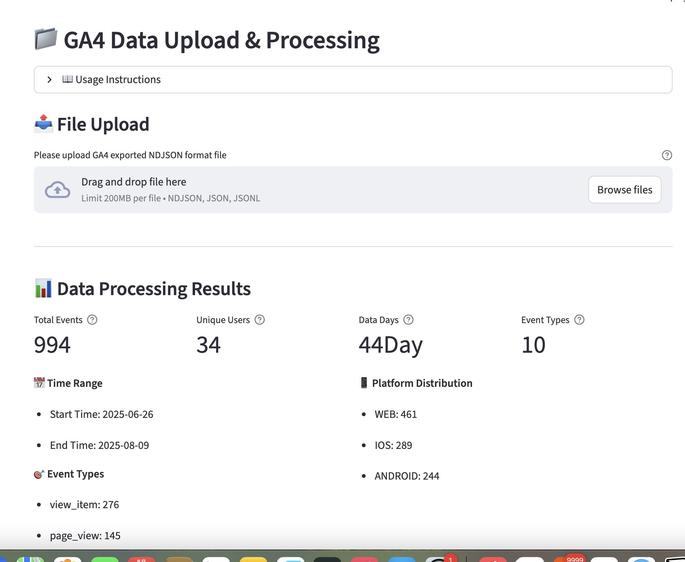
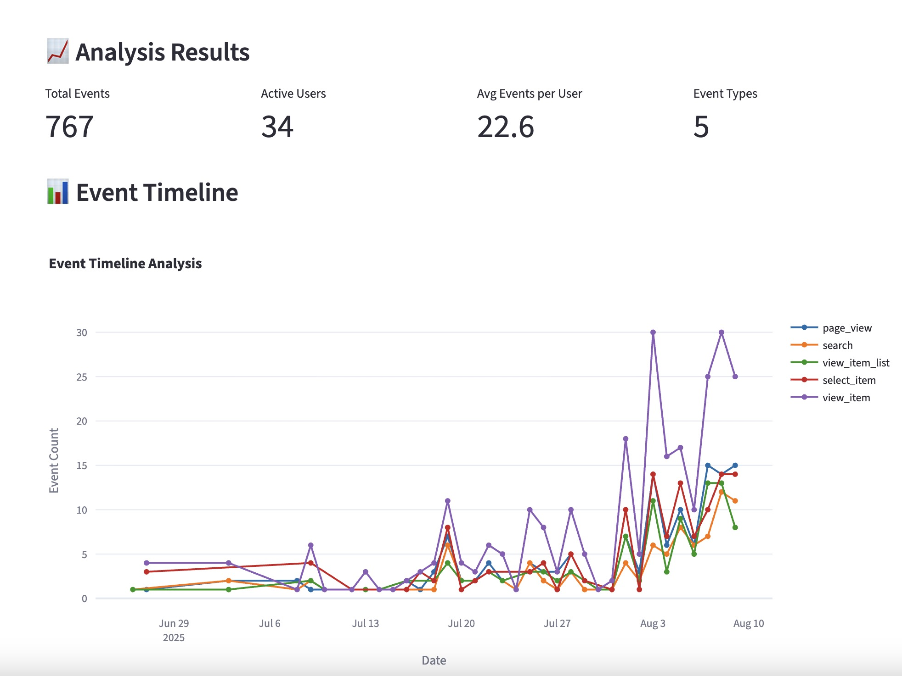
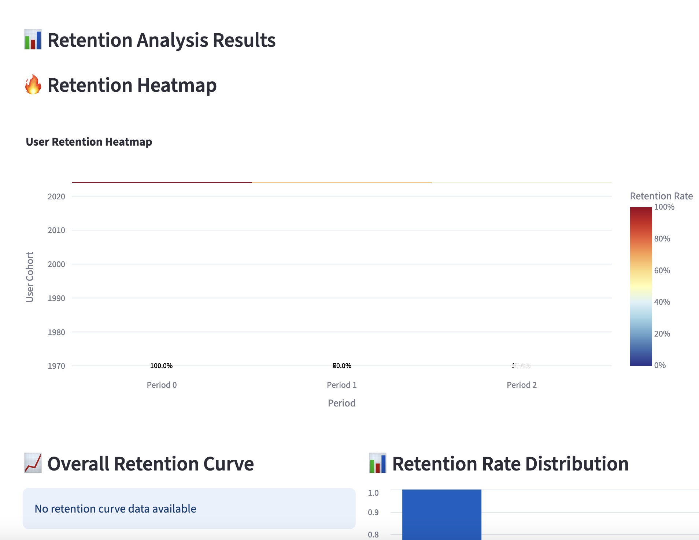
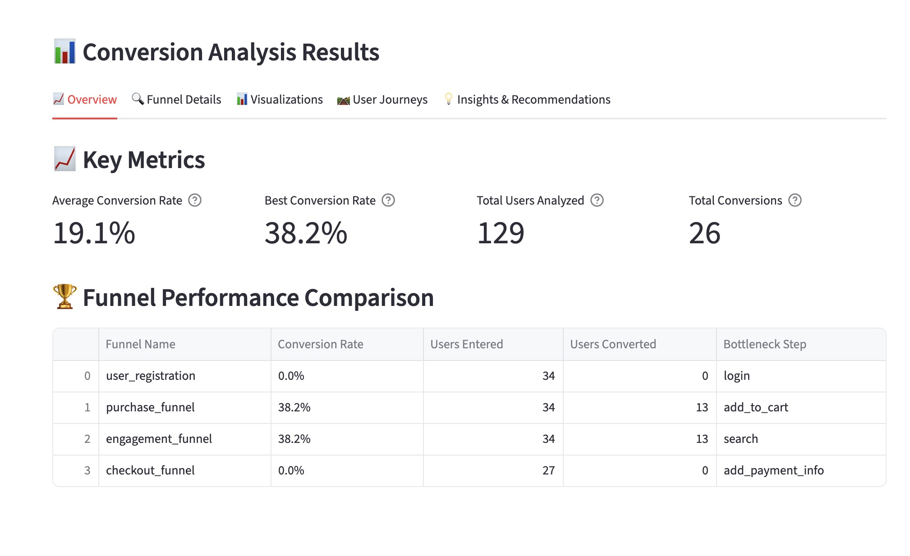
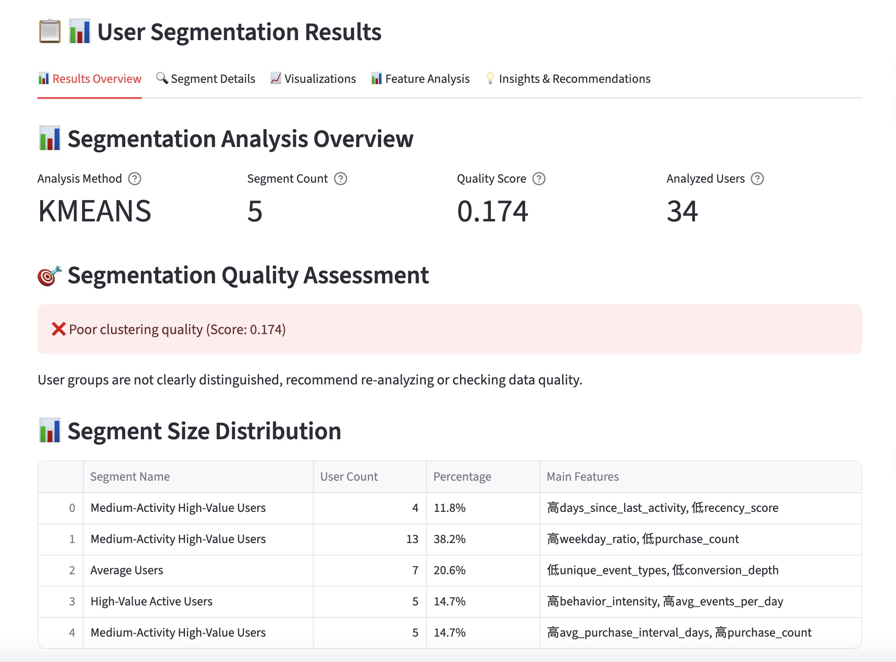
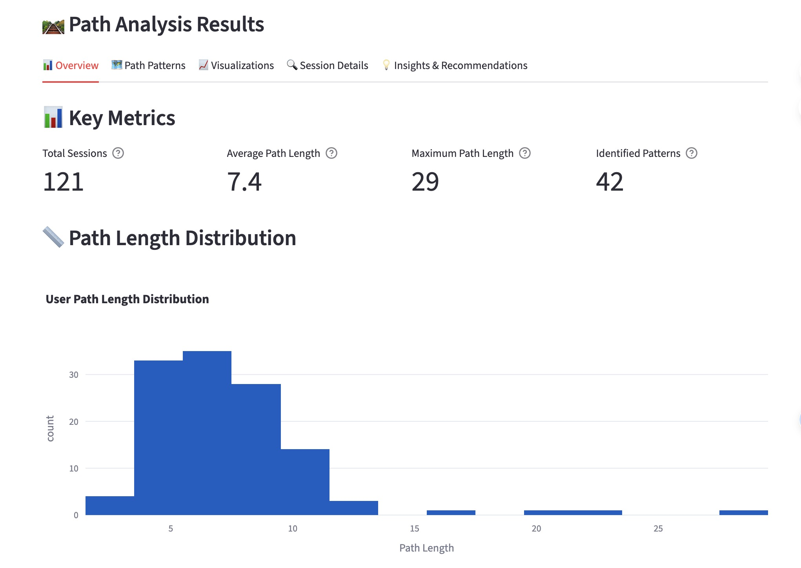

# ZenGrowth - 用户行为分析智能体平台

[](https://opensource.org/licenses/MIT)
[](https://www.python.org/downloads/)
[](https://www.docker.com/)
[](https://streamlit.io/)

[English Documentation](README.md) | 中文文档

基于CrewAI多智能体框架的自动化用户行为分析系统，集成Google Gemini和Volcano ARK API，提供智能化的GA4数据分析和业务洞察。

## 🎥 演示视频

[](https://www.youtube.com/watch?v=yXLHEkLss9Q)

观看完整的产品演示，了解如何使用ZenGrowth进行智能化用户行为分析。

## 🌟 核心特性

### 🤖 多智能体协作系统
- **7个专业化AI智能体**：数据处理、事件分析、留存分析、转化分析、用户分群、路径分析、报告生成
- **CrewAI框架**：智能体间协作和任务编排
- **故障恢复机制**：智能体不可用时自动切换到简化引擎

### 🧠 双LLM提供商支持
- **Google Gemini-2.5-pro**：主要AI分析引擎
- **Volcano ARK API**：备用提供商和中文优化
- **智能故障转移**：自动提供商切换和负载均衡
- **多模态支持**：图像、文本综合分析

### 📊 全方位数据分析
- **事件分析**：用户行为事件模式识别和趋势分析
- **留存分析**：用户留存率计算和流失预测
- **转化分析**：转化漏斗构建和瓶颈识别
- **用户分群**：基于行为特征的智能用户分群
- **路径分析**：用户行为路径挖掘和导航优化

### 🎨 交互式可视化
- **Streamlit界面**：现代化Web应用体验
- **Plotly图表**：交互式数据可视化
- **多语言支持**：中英文界面切换
- **响应式设计**：支持多种设备和屏幕

### 🔧 企业级特性
- **Docker容器化**：生产环境部署优化
- **配置管理**：灵活的环境配置和参数调优
- **健康监控**：实时系统状态和性能监控
- **安全性**：API密钥管理和访问控制

## 🏗️ 技术架构

```
┌─────────────────────────────────────────────────────────────────┐
│                    用户界面层 (Streamlit)                         │
├─────────────────────────────────────────────────────────────────┤
│                 智能体编排层 (CrewAI + 故障恢复)                    │
├─────────────────┬─────────────────┬─────────────────┬─────────────┤
│   事件分析智能体   │   留存分析智能体   │   转化分析智能体   │   路径分析智能体  │
├─────────────────┼─────────────────┼─────────────────┼─────────────┤
│   用户分群智能体   │   数据处理智能体   │   报告生成智能体   │   可视化引擎    │
├─────────────────────────────────────────────────────────────────┤
│                 LLM提供商层 (Google + Volcano)                   │
├─────────────────────────────────────────────────────────────────┤
│                   数据处理层 (GA4 + 文件存储)                      │
└─────────────────────────────────────────────────────────────────┘
```

## 📋 系统要求

### 🖥️ 本地运行
- **Python**: 3.8+ (推荐3.9+)
- **内存**: 8GB+ RAM (推荐16GB)
- **存储**: 2GB+ 可用磁盘空间
- **API密钥**: Google Gemini API 或 Volcano ARK API

### 🐳 Docker运行 (推荐)
- **Docker Engine**: 20.10+
- **Docker Compose**: 2.0+
- **内存**: 4GB+ RAM可用
- **存储**: 10GB+ 可用磁盘空间

## 🚀 快速开始

### 方式一：Docker部署 (推荐)

#### 1. 克隆项目
```bash
git clone https://github.com/your-repo/ZenGrowth.git
cd ZenGrowth
```

#### 2. 配置环境变量
```bash
# 复制环境变量模板
cp .env.example .env

# 编辑 .env 文件，至少配置以下其中一个API密钥：
# GOOGLE_API_KEY=your_google_api_key_here
# 或
# ARK_API_KEY=your_volcano_ark_api_key_here
```

#### 3. 启动服务

**开发环境：**
```bash
# 使用部署脚本（推荐）
./deploy.sh -e development -a up -b

# 或直接使用Docker Compose
docker-compose -f docker-compose.dev.yml up --build
```

**生产环境：**
```bash
# 使用部署脚本
./deploy.sh -e production -a up -d

# 或直接使用Docker Compose
docker-compose up -d
```

#### 4. 访问应用
- **主应用界面**: http://localhost:8501
- **健康检查**: http://localhost:8502/health
- **监控指标**: http://localhost:8502/metrics

### 方式二：本地开发部署

#### 1. 环境设置
```bash
# 克隆项目
git clone https://github.com/your-repo/ZenGrowth.git
cd ZenGrowth

# 自动设置环境
python setup.py

# 激活虚拟环境
# Windows:
venv\Scripts\activate
# Unix/Linux/macOS:
source venv/bin/activate
```

#### 2. 配置API密钥
编辑 `.env` 文件：
```env
# 必需配置（至少配置其中一个）
GOOGLE_API_KEY=your_google_api_key_here
ARK_API_KEY=your_volcano_ark_api_key_here

# 可选配置
DEFAULT_LLM_PROVIDER=google
LLM_MODEL=gemini-2.5-pro
LLM_TEMPERATURE=0.1
APP_TITLE=ZenGrowth用户行为分析平台
```

#### 3. 启动应用
```bash
# 标准启动
streamlit run main.py

# 或指定端口
streamlit run main.py --server.port 8502

# 或使用直接启动脚本
python start_app_direct.py
```

## 📁 项目结构

```
ZenGrowth/
├── 📁 agents/                    # CrewAI智能体模块
│   ├── conversion_analysis_agent.py     # 转化分析智能体
│   ├── event_analysis_agent.py          # 事件分析智能体
│   ├── retention_analysis_agent.py      # 留存分析智能体
│   ├── user_segmentation_agent.py       # 用户分群智能体
│   ├── path_analysis_agent.py           # 路径分析智能体
│   └── shared/                          # 共享组件
├── 📁 engines/                   # 分析引擎（智能体故障恢复）
│   ├── conversion_analysis_engine.py    # 转化分析引擎
│   ├── event_analysis_engine.py         # 事件分析引擎
│   ├── retention_analysis_engine.py     # 留存分析引擎
│   └── user_segmentation_engine.py      # 用户分群引擎
├── 📁 ui/                        # 用户界面模块
│   ├── components/                      # UI组件
│   ├── pages/                          # 页面模块
│   ├── layouts/                        # 布局组件
│   └── state/                          # 状态管理
├── 📁 tools/                     # 数据处理工具
│   ├── ga4_data_parser.py              # GA4数据解析器
│   ├── data_storage_manager.py         # 数据存储管理
│   └── data_validator.py               # 数据验证器
├── 📁 visualization/             # 可视化模块
│   ├── chart_generator.py              # 图表生成器
│   └── report_generator.py             # 报告生成器
├── 📁 config/                    # 配置管理
│   ├── settings.py                     # 系统配置
│   ├── llm_provider_manager.py         # LLM提供商管理
│   └── system_config.json              # 系统配置文件
├── 📁 utils/                     # 工具函数
│   ├── i18n.py                         # 国际化支持
│   ├── config_manager.py               # 配置管理器
│   └── performance_optimizer.py        # 性能优化器
├── 📁 system/                    # 核心系统
│   └── integration_manager_singleton.py # 集成管理器
├── 📁 languages/                 # 多语言支持
│   ├── en-US.json                      # 英文语言包
│   └── zh-CN.json                      # 中文语言包
├── 📁 data/                      # 数据存储目录
├── 📁 logs/                      # 日志文件目录
├── 📁 reports/                   # 报告输出目录
├── 📄 main.py                    # 主应用入口
├── 📄 requirements.txt           # 项目依赖
├── 📄 docker-compose.yml         # Docker编排文件
└── 📄 deploy.sh                  # 部署脚本
```

## 🔧 配置指南

### 环境变量配置

#### 核心配置
```env
# === API密钥配置（必需，至少配置一个） ===
GOOGLE_API_KEY=your_google_api_key_here          # Google Gemini API密钥
ARK_API_KEY=your_volcano_ark_api_key_here        # Volcano ARK API密钥

# === LLM提供商配置 ===
DEFAULT_LLM_PROVIDER=google                      # 默认提供商: google, volcano
ENABLED_PROVIDERS=["google", "volcano"]          # 启用的提供商列表
FALLBACK_ORDER=["google", "volcano"]             # 故障转移顺序
ENABLE_FALLBACK=true                             # 启用故障转移

# === 模型配置 ===
LLM_MODEL=gemini-2.5-pro                        # Google模型名称
LLM_TEMPERATURE=0.1                             # 模型温度参数
LLM_MAX_TOKENS=4000                             # 最大输出token数

# === Volcano配置 ===
ARK_BASE_URL=https://ark.cn-beijing.volces.com/api/v3
ARK_MODEL=doubao-seed-1-6-250615               # Volcano模型名称

# === 应用配置 ===
APP_TITLE=ZenGrowth用户行为分析平台             # 应用标题
LOG_LEVEL=INFO                                  # 日志级别
STREAMLIT_SERVER_PORT=8501                      # 服务端口

# === 多模态配置 ===
ENABLE_MULTIMODAL=true                          # 启用多模态功能
MAX_IMAGE_SIZE_MB=10                            # 最大图片大小
SUPPORTED_IMAGE_FORMATS=["jpg","png","gif"]     # 支持的图片格式
```

#### Docker专用配置
```env
# === Docker特定配置 ===
DOCKER_ENV=production                           # Docker环境标识
CONTAINER_PORT=8501                             # 容器内部端口
VOLUME_DATA_PATH=./data                         # 数据卷路径
VOLUME_LOGS_PATH=./logs                         # 日志卷路径

# === 资源限制 ===
MEMORY_LIMIT=2G                                 # 内存限制
CPU_LIMIT=1.0                                   # CPU限制
```

### 系统配置文件

#### config/system_config.json
```json
{
  "ui_settings": {
    "language": "zh-CN",
    "theme": "light",
    "sidebar_collapsed": false
  },
  "analysis_settings": {
    "retention_periods": [1, 7, 14, 30],
    "min_cluster_size": 100,
    "max_file_size_mb": 100,
    "chunk_size": 10000
  },
  "performance_settings": {
    "enable_caching": true,
    "cache_ttl": 3600,
    "max_concurrent_analysis": 3
  }
}
```

## 📊 使用指南

### 1. 数据上传
- 支持GA4导出的NDJSON格式文件
- 单个文件最大100MB
- 自动数据验证和清洗



### 2. 分析功能

#### 🎯 事件分析
- 事件趋势分析
- 事件分布统计
- 事件时间线可视化
- 异常事件检测



#### 📈 留存分析
- 用户留存率计算
- 留存热力图展示
- 流失用户预测
- 留存改进建议



#### 🔄 转化分析
- 转化漏斗构建
- 转化瓶颈识别
- 多渠道转化对比
- 转化优化建议



#### 👥 用户分群
- 基于行为的用户分群
- RFM模型分析
- 用户价值评估
- 个性化策略建议



#### 🛤️ 路径分析
- 用户行为路径挖掘
- 关键路径识别
- 路径优化建议
- 导航模式分析



### 3. 报告导出
- PDF格式报告
- Excel数据导出
- JSON结构化数据
- 图表PNG/SVG导出

## 🤖 智能体详解

### 1. 数据处理智能体
- **职责**：GA4数据解析、清洗、验证
- **输出**：标准化数据结构、数据质量报告

### 2. 事件分析智能体
- **职责**：用户事件模式识别、趋势分析
- **输出**：事件洞察、异常检测、优化建议

### 3. 留存分析智能体
- **职责**：用户留存计算、流失预测
- **输出**：留存报告、风险用户识别、改进策略

### 4. 转化分析智能体
- **职责**：转化漏斗分析、瓶颈识别
- **输出**：转化报告、优化建议、A/B测试建议

### 5. 用户分群智能体
- **职责**：用户行为分群、价值评估
- **输出**：用户画像、分群策略、个性化建议

### 6. 路径分析智能体
- **职责**：用户行为路径挖掘、导航优化
- **输出**：路径图谱、关键节点、优化方案

### 7. 报告生成智能体
- **职责**：综合分析结果、生成业务报告
- **输出**：执行摘要、详细报告、行动计划

## 🛠️ 故障排除

### Docker部署问题

#### 容器启动失败
```bash
# 检查容器状态
docker-compose ps

# 查看容器日志
docker-compose logs analytics-platform

# 验证配置
./deploy.sh -e development -a status
```

#### API密钥问题
```bash
# 检查环境变量
docker-compose exec analytics-platform env | grep API

# 测试API连接
curl http://localhost:8502/health/detailed
```

#### 端口占用
```bash
# 检查端口占用
netstat -tlnp | grep 8501

# 修改端口配置
# 编辑 docker-compose.yml:
ports:
  - "8503:8501"  # 使用不同的主机端口
```

#### 权限问题
```bash
# 修复数据目录权限
sudo chown -R 1000:1000 ./data ./logs ./reports

# 检查Docker用户权限
docker-compose exec analytics-platform whoami
```

### 本地部署问题

#### 依赖安装失败
```bash
# 升级pip和setuptools
pip install --upgrade pip setuptools wheel

# 清理缓存重新安装
pip cache purge
pip install -r requirements.txt --no-cache-dir
```

#### 内存不足
```bash
# 调整配置参数
# 编辑 config/system_config.json:
{
  "analysis_settings": {
    "chunk_size": 5000,        # 减少处理块大小
    "max_file_size_mb": 50     # 限制文件大小
  }
}
```

#### Python版本问题
```bash
# 检查Python版本
python --version

# 使用pyenv管理Python版本
pyenv install 3.9.18
pyenv local 3.9.18
```

### 性能优化

#### 内存优化
```bash
# 启用内存监控
export LOG_LEVEL=DEBUG

# 调整Streamlit配置
streamlit run main.py --server.maxUploadSize=50
```

#### 缓存配置
```python
# 在 config/system_config.json 中调整
{
  "performance_settings": {
    "enable_caching": true,
    "cache_ttl": 1800,         # 缓存时间30分钟
    "max_concurrent_analysis": 2  # 减少并发分析数
  }
}
```

## 🔐 安全注意事项

### API密钥管理
- ✅ 使用 `.env` 文件存储密钥
- ✅ 不要将密钥提交到版本控制
- ✅ 定期轮换API密钥
- ✅ 使用环境变量覆盖

### 数据安全
- ✅ 本地文件存储，不上传外部服务
- ✅ 数据处理完成后及时清理
- ✅ 支持数据脱敏和匿名化
- ✅ 遵循数据保护法规

### 网络安全
- ✅ Docker容器网络隔离
- ✅ 健康检查端点限制
- ✅ API请求频率限制
- ✅ HTTPS配置支持

## 📚 开发文档

### 扩展开发

#### 添加新的智能体
1. 在 `agents/` 目录创建智能体文件
2. 继承 `BaseAgent` 类
3. 实现必需的方法
4. 在 `IntegrationManager` 中注册

#### 添加新的分析引擎
1. 在 `engines/` 目录创建引擎文件
2. 实现标准分析接口
3. 添加到故障恢复机制中

#### 自定义可视化组件
1. 在 `visualization/` 目录扩展
2. 使用Plotly创建图表
3. 集成到UI页面中

### API参考

#### 核心类
- `IntegrationManager`: 智能体编排和管理
- `GA4DataParser`: GA4数据解析
- `ChartGenerator`: 图表生成
- `LLMProviderManager`: LLM提供商管理

#### 配置管理
- `Settings`: Pydantic配置类
- `ConfigManager`: 配置管理器
- `I18n`: 国际化支持

## 🤝 贡献指南

### 开发流程
1. Fork项目仓库
2. 创建功能分支
3. 编写代码和测试
4. 提交Pull Request

### 代码规范
- 遵循PEP 8编码标准
- 添加必要的注释和文档
- 编写单元测试
- 更新相关文档

### 测试指南
```bash
# 运行所有测试
python -m pytest tests/

# 运行特定测试
python test_chart_internationalization.py
python test_integration_manager_simple.py

# 生成测试覆盖率报告
pytest --cov=. --cov-report=html
```

## 📄 许可证

本项目基于 [MIT许可证](LICENSE) 开源发布。

## 📞 支持与反馈

### 获取帮助
- 📖 **查看文档**: 详细文档和FAQ
- 🐛 **提交Issue**: GitHub Issues报告问题
- 💬 **社区讨论**: GitHub Discussions
- 📧 **邮件支持**: 联系项目维护者

### 问题排查流程
1. 查看[故障排除指南](#🛠️-故障排除)
2. 检查[系统健康状态](http://localhost:8502/health)
3. 查看应用日志文件
4. 提交详细的Issue报告

### 贡献方式
- 🌟 给项目加星标
- 🐛 报告Bug和问题
- 💡 提出功能建议
- 📝 改进文档
- 🔧 提交代码贡献

---

<div align="center">

**ZenGrowth** - 让数据分析更智能，让业务洞察更深入

[🌟 Star](https://github.com/your-repo/ZenGrowth) | [🐛 Report Bug](https://github.com/your-repo/ZenGrowth/issues) | [💡 Request Feature](https://github.com/your-repo/ZenGrowth/issues)

</div>