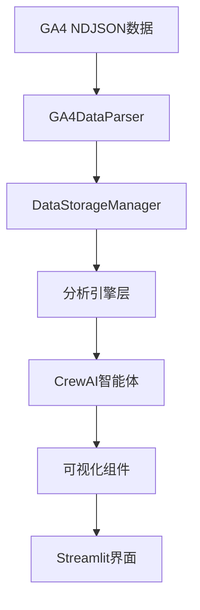

# API文档和开发者指南

## 📋 概述

本文档提供用户行为分析智能体平台的完整API文档和开发者指南。平台采用模块化设计，主要包含数据处理、分析引擎、智能体系统和可视化组件等核心模块。

## 🏗️ 架构概览

### 核心模块结构

```
user-behavior-analytics-platform/
├── agents/          # CrewAI智能体模块
├── engines/         # 分析引擎模块  
├── tools/           # 数据处理工具
├── config/          # 配置管理
├── utils/           # 工具函数
├── visualization/   # 可视化组件
└── system/          # 系统集成
```

### 数据流架构



## 🔧 核心API

### 1. 数据处理API

#### GA4DataParser

GA4数据解析器，负责NDJSON格式数据的解析和预处理。

```python
from tools.ga4_data_parser import GA4DataParser

# 初始化解析器
parser = GA4DataParser()

# 解析NDJSON文件
data = parser.parse_ndjson(file_path: str) -> pd.DataFrame

# 提取事件数据
events = parser.extract_events(data: pd.DataFrame) -> pd.DataFrame

# 提取用户属性
users = parser.extract_user_properties(data: pd.DataFrame) -> pd.DataFrame

# 提取会话数据
sessions = parser.extract_sessions(data: pd.DataFrame) -> pd.DataFrame

# 数据质量验证
quality_report = parser.validate_data_quality(data: pd.DataFrame) -> Dict[str, Any]
```

**方法详解**:

- `parse_ndjson(file_path: str) -> pd.DataFrame`
  - **参数**: `file_path` - NDJSON文件路径
  - **返回**: 解析后的DataFrame
  - **异常**: `FileNotFoundError`, `JSONDecodeError`

- `extract_events(data: pd.DataFrame) -> pd.DataFrame`
  - **参数**: `data` - 原始GA4数据
  - **返回**: 事件数据DataFrame，包含字段：
    - `event_date`: 事件日期
    - `event_timestamp`: 事件时间戳
    - `event_name`: 事件名称
    - `user_pseudo_id`: 用户伪ID
    - `user_id`: 用户真实ID (可选)
    - `platform`: 平台信息
    - `device`: 设备信息
    - `geo`: 地理位置信息

#### DataStorageManager

数据存储管理器，提供内存数据存储和检索功能。

```python
from tools.data_storage_manager import DataStorageManager

# 初始化存储管理器
storage = DataStorageManager()

# 存储数据
storage.store_events(events: pd.DataFrame) -> None
storage.store_users(users: pd.DataFrame) -> None
storage.store_sessions(sessions: pd.DataFrame) -> None

# 检索数据
events = storage.get_events(filters: Dict[str, Any] = None) -> pd.DataFrame
users = storage.get_users(filters: Dict[str, Any] = None) -> pd.DataFrame
sessions = storage.get_sessions(filters: Dict[str, Any] = None) -> pd.DataFrame

# 数据统计
stats = storage.get_data_summary() -> Dict[str, Any]
```

**过滤器参数**:
```python
filters = {
    'date_range': ('2024-01-01', '2024-01-31'),
    'event_names': ['page_view', 'purchase'],
    'user_ids': ['user123', 'user456'],
    'platforms': ['web', 'mobile']
}
```

### 2. 分析引擎API

#### EventAnalysisEngine

事件分析引擎，提供事件频次、趋势和关联性分析。

```python
from engines.event_analysis_engine import EventAnalysisEngine

# 初始化引擎
engine = EventAnalysisEngine(storage_manager)

# 事件频次分析
frequency_results = engine.analyze_event_frequency(
    event_types: Optional[List[str]] = None,
    date_range: Optional[Tuple[str, str]] = None,
    granularity: str = 'day'
) -> Dict[str, EventFrequencyResult]

# 事件趋势分析
trend_results = engine.analyze_event_trends(
    event_types: Optional[List[str]] = None,
    date_range: Optional[Tuple[str, str]] = None,
    window_size: int = 7
) -> Dict[str, EventTrendResult]

# 事件关联性分析
correlation_results = engine.analyze_event_correlations(
    event_pairs: Optional[List[Tuple[str, str]]] = None,
    method: str = 'chi2'
) -> Dict[str, EventCorrelationResult]
```

**数据模型**:

```python
@dataclass
class EventFrequencyResult:
    event_name: str
    total_count: int
    unique_users: int
    avg_per_user: float
    frequency_distribution: Dict[str, int]
    percentiles: Dict[str, float]

@dataclass
class EventTrendResult:
    event_name: str
    trend_data: pd.DataFrame
    trend_direction: str  # 'increasing', 'decreasing', 'stable'
    growth_rate: float
    seasonal_pattern: Optional[Dict[str, float]]
    anomalies: List[Dict[str, Any]]
```

#### RetentionAnalysisEngine

留存分析引擎，提供用户留存率计算和队列分析。

```python
from engines.retention_analysis_engine import RetentionAnalysisEngine

# 初始化引擎
engine = RetentionAnalysisEngine(storage_manager)

# 构建用户队列
cohorts = engine.build_user_cohorts(
    cohort_type: str = 'weekly',  # 'daily', 'weekly', 'monthly'
    date_range: Optional[Tuple[str, str]] = None
) -> pd.DataFrame

# 计算留存率
retention_rates = engine.calculate_retention_rates(
    cohorts: pd.DataFrame,
    periods: List[int] = [1, 7, 14, 30]
) -> pd.DataFrame

# 生成留存热力图数据
heatmap_data = engine.generate_retention_heatmap(
    retention_data: pd.DataFrame
) -> Dict[str, Any]
```

#### ConversionAnalysisEngine

转化分析引擎，提供转化漏斗构建和转化率计算。

```python
from engines.conversion_analysis_engine import ConversionAnalysisEngine

# 初始化引擎
engine = ConversionAnalysisEngine(storage_manager)

# 构建转化漏斗
funnel = engine.build_conversion_funnel(
    funnel_steps: List[str],
    conversion_window_hours: int = 24,
    date_range: Optional[Tuple[str, str]] = None
) -> pd.DataFrame

# 计算转化率
conversion_rates = engine.calculate_conversion_rates(
    funnel_data: pd.DataFrame
) -> Dict[str, float]

# 识别转化瓶颈
bottlenecks = engine.identify_conversion_bottlenecks(
    funnel_data: pd.DataFrame,
    threshold: float = 0.5
) -> List[Dict[str, Any]]
```

### 3. CrewAI智能体API

#### 智能体创建和配置

```python
from config.crew_config import create_agent, create_task, CrewManager

# 创建单个智能体
agent = create_agent(
    agent_type: str,  # 'data_processor', 'event_analyst', etc.
    tools: List[BaseTool] = None
)

# 创建任务
task = create_task(
    description: str,
    agent: Agent,
    expected_output: str = None
)

# 使用团队管理器
crew_manager = CrewManager()
crew_manager.add_agent('event_analyst', tools=[event_analysis_tool])
crew_manager.add_task('分析用户事件模式', 'event_analyst')
results = crew_manager.execute()
```

#### 智能体工具开发

创建自定义智能体工具：

```python
from crewai.tools import BaseTool
from pydantic import BaseModel, Field

class CustomAnalysisTool(BaseTool):
    name: str = "custom_analysis"
    description: str = "自定义分析工具描述"
    
    def __init__(self, **kwargs):
        super().__init__()
        # 初始化工具参数
    
    def _run(self, **kwargs) -> Dict[str, Any]:
        """工具执行逻辑"""
        # 实现分析逻辑
        return analysis_results
```

### 4. 可视化API

#### ChartGenerator

基础图表生成器，基于Plotly创建交互式图表。

```python
from visualization.chart_generator import ChartGenerator

# 初始化图表生成器
chart_gen = ChartGenerator()

# 创建事件时间线图
timeline_fig = chart_gen.create_event_timeline(
    data: pd.DataFrame,
    event_column: str = 'event_name',
    time_column: str = 'event_timestamp',
    title: str = '事件时间线'
) -> plotly.graph_objects.Figure

# 创建留存热力图
heatmap_fig = chart_gen.create_retention_heatmap(
    data: pd.DataFrame,
    title: str = '用户留存热力图'
) -> plotly.graph_objects.Figure

# 创建转化漏斗图
funnel_fig = chart_gen.create_conversion_funnel(
    data: pd.DataFrame,
    steps_column: str = 'step',
    values_column: str = 'users',
    title: str = '转化漏斗'
) -> plotly.graph_objects.Figure
```

#### AdvancedVisualizer

高级可视化组件，提供复杂的交互式图表。

```python
from visualization.advanced_visualizer import AdvancedVisualizer

# 初始化高级可视化器
viz = AdvancedVisualizer()

# 创建用户行为流程图
flow_fig = viz.create_user_flow_diagram(
    path_data: pd.DataFrame,
    min_flow_count: int = 10
) -> plotly.graph_objects.Figure

# 创建用户分群散点图
scatter_fig = viz.create_user_segmentation_plot(
    user_data: pd.DataFrame,
    features: List[str],
    cluster_column: str = 'cluster'
) -> plotly.graph_objects.Figure
```

### 5. 配置管理API

#### Settings

系统配置管理，基于Pydantic的配置类。

```python
from config.settings import settings, get_google_api_key, validate_config

# 获取配置值
api_key = settings.google_api_key
model_name = settings.llm_model
temperature = settings.llm_temperature

# 验证配置
is_valid = validate_config()

# 获取API密钥（带验证）
api_key = get_google_api_key()
```

#### ConfigManager

动态配置管理器，支持运行时配置更新。

```python
from utils.config_manager import config_manager

# 获取系统配置
system_config = config_manager.get_system_config()
analysis_config = config_manager.get_analysis_config()

# 更新配置
config_manager.update_system_config('api_settings', {
    'llm_temperature': 0.2,
    'llm_max_tokens': 5000
})

# 保存配置
config_manager.save_config()
```

## 🔌 扩展开发

### 添加新的分析引擎

1. **创建引擎类**

```python
from typing import Dict, Any
import pandas as pd

class CustomAnalysisEngine:
    """自定义分析引擎"""
    
    def __init__(self, storage_manager):
        self.storage_manager = storage_manager
    
    def analyze(self, **kwargs) -> Dict[str, Any]:
        """执行自定义分析"""
        # 获取数据
        data = self.storage_manager.get_events()
        
        # 执行分析逻辑
        results = self._perform_analysis(data)
        
        return results
    
    def _perform_analysis(self, data: pd.DataFrame) -> Dict[str, Any]:
        """分析实现"""
        # 实现具体分析逻辑
        pass
```

2. **创建对应的智能体工具**

```python
from crewai.tools import BaseTool

class CustomAnalysisTool(BaseTool):
    name: str = "custom_analysis"
    description: str = "执行自定义分析"
    
    def __init__(self, storage_manager):
        super().__init__()
        self.engine = CustomAnalysisEngine(storage_manager)
    
    def _run(self, **kwargs) -> Dict[str, Any]:
        return self.engine.analyze(**kwargs)
```

3. **集成到智能体系统**

```python
# 在crew_config.py中添加新的智能体角色
AGENT_ROLES["custom_analyst"] = {
    "role": "自定义分析专家",
    "goal": "执行特定的自定义分析任务",
    "backstory": "你是一位专业的自定义分析师..."
}
```

### 添加新的可视化组件

```python
import plotly.graph_objects as go
from typing import Dict, Any

class CustomVisualization:
    """自定义可视化组件"""
    
    def create_custom_chart(self, data: pd.DataFrame, **kwargs) -> go.Figure:
        """创建自定义图表"""
        fig = go.Figure()
        
        # 添加图表元素
        fig.add_trace(go.Scatter(
            x=data['x_column'],
            y=data['y_column'],
            mode='markers+lines'
        ))
        
        # 设置布局
        fig.update_layout(
            title=kwargs.get('title', '自定义图表'),
            xaxis_title=kwargs.get('x_title', 'X轴'),
            yaxis_title=kwargs.get('y_title', 'Y轴')
        )
        
        return fig
```

## 🧪 测试框架

### 单元测试

```python
import unittest
from unittest.mock import Mock, patch
from engines.event_analysis_engine import EventAnalysisEngine

class TestEventAnalysisEngine(unittest.TestCase):
    
    def setUp(self):
        self.mock_storage = Mock()
        self.engine = EventAnalysisEngine(self.mock_storage)
    
    def test_analyze_event_frequency(self):
        # 准备测试数据
        test_data = pd.DataFrame({
            'event_name': ['page_view', 'click', 'page_view'],
            'user_pseudo_id': ['user1', 'user1', 'user2'],
            'event_timestamp': [1640995200, 1640995260, 1640995320]
        })
        
        self.mock_storage.get_events.return_value = test_data
        
        # 执行测试
        results = self.engine.analyze_event_frequency()
        
        # 验证结果
        self.assertIn('page_view', results)
        self.assertEqual(results['page_view'].total_count, 2)
```

### 集成测试

```python
import pytest
from system.integration_manager import IntegrationManager

@pytest.fixture
def integration_manager():
    return IntegrationManager()

def test_full_analysis_workflow(integration_manager):
    """测试完整分析工作流"""
    # 准备测试数据
    test_file = 'test_data/sample_ga4.ndjson'
    
    # 执行完整工作流
    results = integration_manager.run_full_analysis(test_file)
    
    # 验证结果
    assert 'event_analysis' in results
    assert 'retention_analysis' in results
    assert 'conversion_analysis' in results
```

## 📊 性能优化

### 内存管理

```python
# 使用数据分块处理大文件
def process_large_file(file_path: str, chunk_size: int = 10000):
    for chunk in pd.read_json(file_path, lines=True, chunksize=chunk_size):
        # 处理数据块
        processed_chunk = process_data_chunk(chunk)
        yield processed_chunk

# 及时释放内存
def cleanup_memory():
    import gc
    gc.collect()
```

### 缓存机制

```python
from functools import lru_cache
import pickle
from pathlib import Path

class AnalysisCache:
    """分析结果缓存"""
    
    def __init__(self, cache_dir: str = 'cache'):
        self.cache_dir = Path(cache_dir)
        self.cache_dir.mkdir(exist_ok=True)
    
    def get(self, key: str):
        cache_file = self.cache_dir / f"{key}.pkl"
        if cache_file.exists():
            with open(cache_file, 'rb') as f:
                return pickle.load(f)
        return None
    
    def set(self, key: str, value):
        cache_file = self.cache_dir / f"{key}.pkl"
        with open(cache_file, 'wb') as f:
            pickle.dump(value, f)
```

## 🔒 安全考虑

### API密钥管理

```python
import os
from cryptography.fernet import Fernet

class SecureConfig:
    """安全配置管理"""
    
    def __init__(self):
        self.cipher_suite = Fernet(self._get_or_create_key())
    
    def _get_or_create_key(self):
        key_file = '.secret_key'
        if os.path.exists(key_file):
            with open(key_file, 'rb') as f:
                return f.read()
        else:
            key = Fernet.generate_key()
            with open(key_file, 'wb') as f:
                f.write(key)
            return key
    
    def encrypt_api_key(self, api_key: str) -> str:
        return self.cipher_suite.encrypt(api_key.encode()).decode()
    
    def decrypt_api_key(self, encrypted_key: str) -> str:
        return self.cipher_suite.decrypt(encrypted_key.encode()).decode()
```

### 数据验证

```python
from pydantic import BaseModel, validator
from typing import List, Optional

class EventDataModel(BaseModel):
    """事件数据验证模型"""
    event_name: str
    user_pseudo_id: str
    event_timestamp: int
    event_date: str
    
    @validator('event_timestamp')
    def validate_timestamp(cls, v):
        if v <= 0:
            raise ValueError('时间戳必须为正数')
        return v
    
    @validator('event_name')
    def validate_event_name(cls, v):
        if not v or len(v.strip()) == 0:
            raise ValueError('事件名称不能为空')
        return v.strip()
```

## 📚 最佳实践

### 代码规范

1. **遵循PEP 8代码风格**
2. **使用类型注解**
3. **编写详细的文档字符串**
4. **实现适当的错误处理**
5. **使用日志记录关键操作**

### 性能优化

1. **使用向量化操作替代循环**
2. **合理使用缓存机制**
3. **及时释放不需要的内存**
4. **使用异步处理提高并发性能**

### 错误处理

```python
import logging
from typing import Optional

logger = logging.getLogger(__name__)

def safe_analysis_execution(func):
    """安全分析执行装饰器"""
    def wrapper(*args, **kwargs):
        try:
            return func(*args, **kwargs)
        except Exception as e:
            logger.error(f"分析执行失败: {func.__name__}, 错误: {str(e)}")
            return None
    return wrapper

@safe_analysis_execution
def perform_analysis():
    # 分析逻辑
    pass
```

---

*本API文档持续更新中，如有疑问请参考源代码或联系开发团队。*